<html lang="pt-br">
<head>
    <meta charset="utf-8" />
    <meta name="viewport" content="width=1024" />
    <meta name="apple-mobile-web-app-capable" content="yes" />
	<link href="http://fonts.googleapis.com/css?family=Open+Sans:regular,semibold,italic,italicsemibold|PT+Sans:400,700,400italic,700italic|PT+Serif:400,700,400italic,700italic" rel="stylesheet" />
    <link href="css/sql.css" rel="stylesheet" />    
    <link rel="shortcut icon" href="favicon.png" />
    <link rel="apple-touch-icon" href="apple-touch-icon.png" />

	
	
	<link type="text/css" rel="stylesheet" href="css/shCoreDefault.css"/>
	

</head>

<body class="impress-not-supported">

	

		
Seu browser <b>não suporta os recursos</b> do impress.js, a apresentação será exibida de forma básica.

		
Para melhor experiência use as últimas versões do <b>Chrome</b>, <b>Safari</b> ou <b>Firefox</b> browser.

	

	

		
		

			<h1>SQL Server</h1>
			<q>O Microsoft SQL Server é um <b>SGBD</b> 
			Sistema gerenciador de banco de dados relacional desenvolvido pela Microsoft.</q>
			   
			<b>* criado em 1988</b>
		

		

			<h1>Objetivo</h1>
			
		
	
		
		

			<h1>Componentes</h1>
			&bull; Tabelas (entidades) 			
			&bull; Registros (tuplas) - instância de uma tabela 
			&bull; Colunas (atributos) 
			&bull; Chaves (primária e estrangeira) 			
			&bull; Relacionamentos 
			&bull; Views 
			&bull; Procedimentos e funções 
			&bull; Triggers (gatilho) 
			&bull; Índices 
			&bull; Estatísticas 
		
	
		
		

			<h1>Índice</h1>
			

				&bull; Estrutura em disco associado a uma tabela ou view 
				&bull; Agiliza a recuperação das linhas 
				&bull; Índices criados inadequadamente e a falta de índices são as principais fontes de afunilamentos 
			

			<q class="center">EXEMPLO - CEP</q>
			
		

		

			<h1>B-Tree</h1>
			<q class="center">Como funciona?</q>
			 
			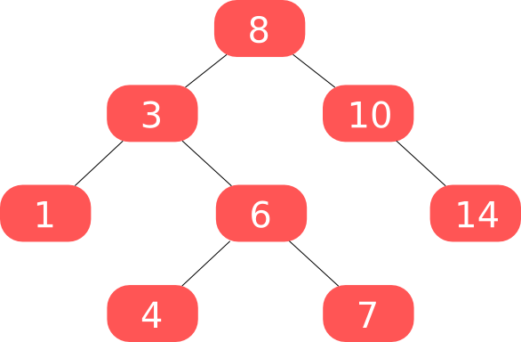
		

		

			<q class="center">Intervalo</q>
			 
			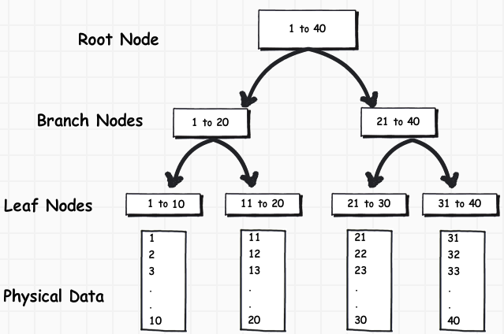
		

		

			<q class="center">Exemplo</q>
			 
			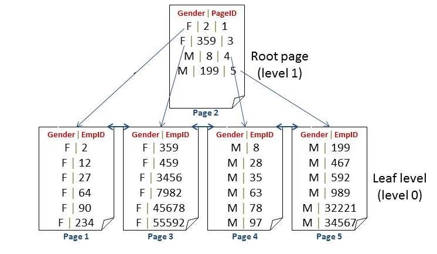
		

		

			<q class="center">Curiosidades</q>
			

				 
				Consulta para 50 linhas  
				em até 6 passos.   
				
				Consulta para mais de 1 bilhão de linhas  
				em até 30 passos.   
				
				Complexidade <b>O(logN)</b> - 2^30 = 1.073.741.824 bilhão   
				
				Árvore Balanceada (folhas com profundidade aproximada)   proporcional à altura da árvore.  
				
				 
				 
				 
				 
			

			
		
		
		
		

			<h1>Opções</h1>
			<q>ASC e DESC</q>
			

				Praticamente indiferente em pesquisas 
				Diferença em ordenação por mais de um campo
				

			<q>Clustered e NonClustered</q>
			

				Ordem de armazenamento em disco 
				Vantagem pesquisa e desvantagem escrita 
				PK é clustered - só é permitido um por tabela
			

			<pre class="brush: sql;">
				create nonclustered index NomeIndice
				on Tabela (Campo1 asc, Campo2 desc);</pre>
		

		

			<h1>Quando</h1>
			<q>
				&bull; Campos de boa seletividade (5% - 10%) 
				&bull; Evitar campos com muita alteração 
				&bull; Criar índices em <b>FK</b> 
				&bull; Índice Composto > Vários Índices Simples 
				&bull; Evitar Full Table Scan* 
			</q>
		

		

			<h1>Composto</h1>
			<pre class="brush: sql;">
				select Nome, Sobrenome
				from   Clientes
				where  Nome = 'Chico'
				and    Sobrenome = 'Bento';</pre>
			<q>
				Criar um índice composto ( Nome, Sobrenome )
				é melhor que criar um índice para cada campo
			</q>
		

		
		

			<h1>Resumo</h1>
			

				Vantagens 
				&bull; Acesso aos dados reduzido 
				&bull; Traz dados específicos de forma mais rápida 
				&bull; Acesso de dados ordenados sem o custo da ordenação 
				 
				Desvantagens 
				&bull; Piora performance em escritas (insert e update) 
				&bull; Aumenta o consumo de memória e disco 
				&bull; Necessidade maior de manutenção 
				&bull; Pode diminuir a performance de consultas 
				&nbsp;&nbsp;&nbsp; - Quando retornamos muitos dados da tabela 
				&nbsp;&nbsp;&nbsp; - Quando volume de dados pequeno (adicionamos 1 etapa) 
			

		

		
		

			<h1>Escrevendo queries otimizadas</h1>
			
&bull;  Lógica de Conjuntos > Lógica de Procedimentos

			
&bull;  Teste variações de queries objetivando a performance

			
&bull;  Evite QUERY HINTS (comum em Oracle)

			
&bull;  Use subqueries correlatas

			<pre class="brush: sql;">
			select	*
			from	Tabela
			where	Campo = 123;</pre>
		

		

			<h1>Tabelas Temporárias</h1>
			<q>#Local</q>
			
Visibilidade restrita, conexão atual

			<q>##Global</q>
			
Visíveis por todas as conexões

			<pre class="brush: sql;">
			if ( exists (
				select	top 1 1
				from	Tempdb..SysObjects
				where	Name like '##TabelaTemporaria%' ) ) begin
				drop table ##TabelaTemporaria;
			end;</pre>
		

		

			<q>TempDB</q>
			<pre class="brush: sql;">
			create #Tabela (
				campoA varchar(16),
				campoB int
			)

			create ##Tabela (
				campoA varchar(16),
				campoB int
			)
			select	p.Nome
			,		p.DataNascimento
			into	#Tabela
			from	Pessoas p
			where	p.Sexo = 'M'</pre>
			Tabelas temporárias permitem criação de índices.
			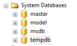
			
		

		

			<q>Variáveis de Tabela</q>
			&bull; Escopo: conexão atual em tempo de execução 
			&bull; Não permitem criação de índice 
			&bull; Dificuldade de debug 
			<pre class="brush: sql;">
			declare @Tabela table (
				campoA smalldatetime,
				campoB int
			)

			insert into @Tabela (campoA, campoB)
				select	nf.DataEmissao
				,		inf.Codigo
				from	NotasFicais nf
				join	ItensNotaFical inf
						on nf.IdNotaFiscal = inf.IdNotaFiscal</pre>
		

		
		

			<q>Qual usar?</q>
			 
			<b>Necessito de estatísticas e plano de execução eficientes?</b>
			 
			Tabelas temporárias - possuem estatísticas
			 
			Variáveis de tabelas - não possuem estatísticas
			 
			Geralmente procedimentos (procedure) utilizam plano de execução em Cache, com o uso de tabelas temporárias é forçada uma nova compilação.
			 
			
			 
			
Não utilize variáveis de tabela   para armazenar mais de 100 linhas

			 
		

		
		

			<q>WITH common_table_expression</q>
			&bull; CTE - expressão de tabela comum  
			&bull; Pode ser utilizada com SELECT, INSERT, UPDATE e DELETE  
			&bull; Muito usado para recursão  
			 
			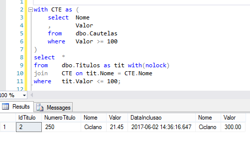
		

		

			<b>Recursividade</b>
			  
			
		

		
		

			<q><i>char, nchar, varchar</i> e <i>nvarchar</i></q>
			 
			<table>
				<tr>
					<th>Tipo</th>
					<th>Unicode</th>
					<th>Tamanho</th>
				</tr>
				<tr>
					<td>nchar</td>
					<td>Sim</td>
					<td>Fixo</td>
				</tr>
				<tr>
					<td>nvarchar</td>
					<td>Sim</td>
					<td>Variável</td>
				</tr>
				<tr>
					<td>char</td>
					<td>Não</td>
					<td>Fixo</td>
				</tr>
				<tr>
					<td>varchar</td>
					<td>Não</td>
					<td>Variável</td>
				</tr>
			</table>
			
			 
			&bull; <b>fixo</b> reserva o espaço de memória mesmo que não seja utilizado 
			&bull; <b>variável</b> ocupa o espaço do que foi utilizado 
			&bull; <b>unicode</b> representar e manipular, de forma consistente, texto de qualquer sistema de escrita existente 
		
		

		

			<q>RAISERROR</q>
			

				<pre class="brush: sql;">
				begin try
					declare @result INT			
					set @result = 55/0 --Divide-by-zero error
				end try
				begin catch
					--Get the details of the error
					--that invoked the CATCH block
					declare		@ErMessage nvarchar(2048)
					,			@ErSeverity int
					,			@ErState int;
				 
					select	@ErMessage = ERROR_MESSAGE()
					,		@ErSeverity = ERROR_SEVERITY()
					,		@ErState = ERROR_STATE();
				 
					raiserror (@ErMessage, @ErSeverity, @ErState)
				end catch
				
				--RESULT:
				--Msg 50000, Level 16, State 1, Line 16
				--Divide by zero error encountered.</pre>
			

		

		

			<q>THROW</q>
			<pre class="brush: sql;">
			begin try
			  declare @result int
			  set @result = 55/0 --Divide-by-zero error
			end try
			begin catch
				throw
			end catch

			--RESULT:
			--Msg 8134, Level 16, State 1, Line 3
			--Divide by zero error encountered.</pre>			
		

		

			Interrompe a execução?
			

				<pre class="brush: sql;">
				begin
					print 'BEFORE RAISERROR'
					raiserror('RAISERROR TEST',16,1)
					print 'AFTER RAISERROR'
				end
				
				--RESULT:
				--BEFORE RAISERROR
				--Msg 50000, Level 16, State 1, Line 3
				--RAISERROR TEST
				--AFTER RAISERROR</pre>

				<pre class="brush: sql;">
				begin
					print 'BEFORE THROW';
					throw 50000,'THROW TEST',1
					print 'AFTER THROW'
				end
				
				--RESULT:
				--BEFORE THROW
				--Msg 50000, Level 16, State 1, Line 3
				--THROW TEST</pre>
			

		

		
		

			<b>ROLLUP e CUBE</b> 
			Comandos de totalização  
			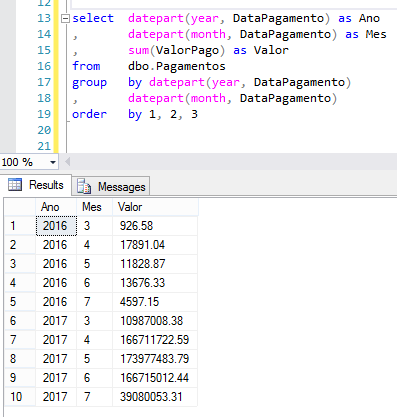
		

		

			<b>ROLLUP</b>
			 
			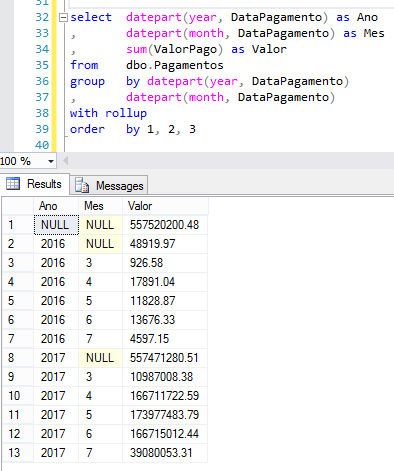
		

		

			<b>CUBE</b>
			 
			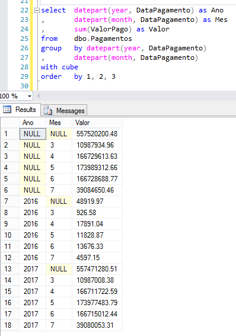
		

		

			<q>PIVOT e UNPIVOT</q>
			Transforma linhas em colunas e vice-versa.  
			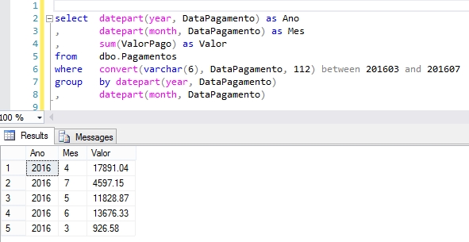
		

		

			<q>PIVOT</q> 
			
		

		

			<h1>Coluna Calculada</h1>
			&bull; É uma coluna virtual. 
			&bull; Não está fisicamente armazenada na tabela <b>*PERSISTED*</b> 
			&bull; Se baseia em dados que já existem. 
			&bull; <b>DEFAULT</b>, <b>FOREIGN KEY</b> e <b>NOT NULL</b> - não pode ser usada 
			<pre class="brush: sql;">
			ALTER TABLE dbo.Produto
			ADD ValorTotal AS (Quantidade * ValorUnitario * 1.5)</pre>
		

		

			<b>UNION e UNION ALL</b>  
			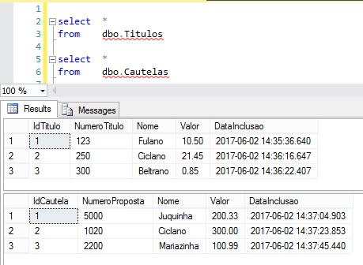
			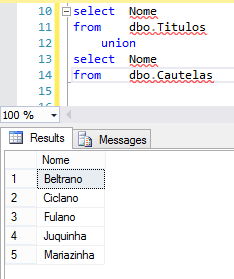
			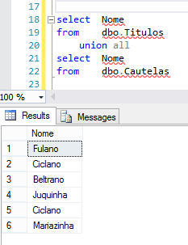
		

		
		

			<b>EXCEPT</b>  
			
			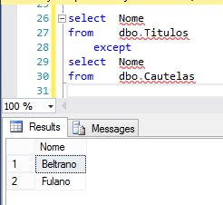
			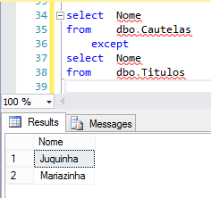
		

		
		

			<b>INTERSECT</b>  
			
			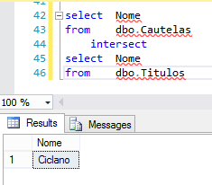
		

		

			<h1>Recapitulando</h1>
			&bull; UNION - combina resultados = distinct + order by 
			&bull; UNION ALL - combina resultados (mais rápido) 
			&bull; EXCEPT - Um conjunto menos o outro 
			&bull; INTERSECT - Igual nos dois 
			 
			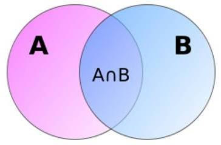
		
		

		

			<b>MERGE</b> 
			 
			&bull; Insert, Update e/ou Delete - tudo junto e reunido
			<pre class="brush: sql;">
				merge  dbo.Titulos as T
				using  @Tab as S on (T.IdTitulo = S.IdTitulo)
				when matched and (T.Nome != S.Nome) then 
					update set T.Nome = S.Nome
				when not matched by Target then
					insert (NumeroTitulo, Nome, Valor, DataInclusao) 
					values (999, S.Nome, 0, getdate())
				when not matched by Source then 
					delete
				output $action, 
				DELETED.IdTitulo as TargetIdTitulo, 
				INSERTED.IdTitulo as TargetIdTitulo;</pre>
		

		
		

			<h1>WITH (NOLOCK)</h1>
			
			&bull; SQL Server 2000 - a própria Microsoft recomendava o uso do <b>NOLOCK</b> 
			&bull; O uso indiscriminado do With(Nolock) pode gerar erros transitórios. 
			&bull; <b>SELECT</b> em conjunto com <b>UPDATE</b> e/ou <b>DELETE</b> 
			&bull; SQL Server 2005/2008 - solução mais elegante  <b>READ COMMITTED SNAPSHOT</b> 
			&bull; Configuração do banco de dados e não necessita alteração em código. 
			&bull; Mantém as versões em <b>tempdb</b>.
		

		
		

			<h1>PRIMARY KEY   UNIQUE KEY</h1>
			<table>
				<tr>
					<th style="width: 20%;"></th>
					<th>Primary Key</th>
					<th>Unique Key</th>
				</tr>
				<tr>
					<td>NULL</td>
					<td>Não</td>
					<td>Sim</td>
				</tr>
				<tr>
					<td>INDEX</td>
					<td>Default clustered index</td>
					<td>Default non-clustered index</td>
				</tr>
				<tr>
					<td>LIMITE</td>
					<td>1</td>
					<td>1 ou +</td>
				</tr>
			</table>
			 
			<b>*Ambos não permitem valores duplicados</b>
			 
			 
			Exemplo tabela de Pessoas : Primary Key <b>Id</b> - Unique Key <b>CPF</b>
		

		

			<b>DATETIME e DATETIME2</b>  
			<table>
				<tr>
					<th style="width: 20%;"></th>
					<th style="width: 33%;">DateTime</th>
					<th style="width: 33%;">DateTime2[(n)]</th>
				</tr>
				<tr>
					<td>Min Value</td>
					<td>1753-01-01 00:00:00</td>
					<td>0001-01-01 00:00:00</td>
				</tr>
				<tr>
					<td>Max Value</td>
					<td>9999-12-31 23:59:59.997</td>
					<td>9999-12-31 23:59:59.9999999</td>
				</tr>
				<tr>
					<td>Storage Size</td>
					<td>8 Bytes</td>
					<td>6 to 8 bytes</td>
				</tr>
				<tr>
					<td>Usage</td>
					<td>Declare @now datetime</td>
					<td>Declare @now datetime2(7)</td>
				</tr>
				<tr>
					<td>Current Date </td>
					<td>GetDate()</td>
					<td>SYSDATETIME()</td>
				</tr>
				<tr>
					<td>+/- days</td>
					<td>Works   select getdate() + 1 </td>
					<td>Fail - need to use only DateAdd function   select dateadd(day, 1, sysdatetime()) </td>
				</tr>
			</table>
		

		
		

			<h1>Check Constraint</h1>
			&bull; Integridade dos dados 
			&bull; Evita tabela de domínio 
			&bull; Exige cuidado e manutenção 
			<pre class="brush: sql;">
			ALTER TABLE dbo.Pessoa
			ADD Sexo char(1) CHECK ( Sexo in ('M', 'F') )</pre>
			<pre class="brush: sql;">
			ALTER TABLE dbo.Produto
			ADD Validade int CHECK (
				Validade >= 1 and Validade < 13
			)</pre>
		
	

		

			<h1>Otimizador de Consultas</h1>
			<q>Estatísticas</q>
			
Número de registros, índices, chaves e cardinalidade das tabelas.

			<q>Plano de Execução</q>
			
Menor custo (CPU e IO) e tempo.

			 
			
		

		
		

			<q>Boas Práticas 01</q>
			 
			&bull; Normalize - basicamente divida tabelas grandes em tabelas menores e remova redundância
			  
			&bull; Evite tabelas resultado ou totalizadoras
			  
			&bull; Utilize transações, vários problemas podem ocorrer
			  
			&bull; Evite a utilização do SELECT * - traga somente o que for utilizar
			  
			&bull; INSERT - específique os campos inseridos
			<pre class="brush: sql;">
			insert into dbo.Tabela (Campo1, Campo2)
			select Valor1, Valor2 from dbo.OutraTabela</pre>			
		

		

			<q>Boas Práticas 02</q> 
			&bull; Evite uso de cursores - podemos usar variável de tabela (lógica de conjunto)
			  
			&bull; Tratamento de erros <b>TRY</b> e <b>CATCH</b>
			  			
			&bull; Usar o <b>THROW</b> ao invés de <b>RAISERROR</b>
			  
			&bull; Usar <b>JOIN</b> ao invés de <b>SUB-QUERIES</b>
			  			
			&bull; Usar <b>ORDER BY</b>, <b>DISTINCT</b> e <b>TOP</b> somente quando necessário
			  
			&bull; Em geral <b>EXISTS</b> e <b>IN</b> são mais eficiente que <b>NOT EXISTS</b> e <b>NOT IN</b> 
			Moldar a consulta para usar o mais eficiente
		

		

			<q>Boas Práticas 03</q> 
			&bull; Utilize o <b>EXISTS</b> em conjunto com o <b>SELECT TOP 1</b>
			 
			&bull; Utilize o <b>EXISTS</b> ao invés de <b>COUNT</b> para teste de existência 
			&bull;  <b>EXISTS</b> pára a execução quando encontra o primeiro e o <b>COUNT</b> continua a execução até o último registro
			  
			
			<pre class="brush: sql;">
			if ( exists ( select top 1 1 from dbo.Pagamentos )) begin
				print 'ok'
			end</pre>
			&bull; Quando usar <b>LIKE</b> procure utilizar: 
			<pre class="brush: sql;">
				where Campo LIKE '%Fula%' --não usa índice
				where Campo LIKE 'Fula%' --usa índice</pre>
		

		

			<q>Boas Práticas 03.1</q> 
			&bull; Usar o <b>@@ROWCOUNT</b> e <b>@@ERROR</b> após a execução de um comando
			
			<pre class="brush: sql;">
			insert into dbo.Cidades (Nome)
			values ('Porto Alegre')
			,      ('Cachoeirinha');

			select @@rowcount;

			--RETURN:
			--2
			
			select @@error;
			--RETURN:
			--0</pre>			
		

		
		

			<q>Boas Práticas 03.2</q> 		
			&bull; Usar o <b>scope_identity()</b> após uma inserção para retornar o identity
			
			<pre class="brush: sql;">
			insert into dbo.Titulos (NumeroTitulo, Nome, Valor, DataInclusao)
			values ('987654321', 'Juca', 55.25, sysdatetime())

			select scope_identity();
			--RETURN:
			--4</pre>
			
			&bull; Usar <b>with(nolock)</b> ao invés de <b>(nolock)</b> 
			Será descontinuado, pode virar alias, dá erro em hint composto
			  
			&bull; Ao invés de <b>where idade > 3</b> use <b>where idade >= 4</b> *se o campo possuir índice
			  
			&bull; Usar <b>";"</b> para fechar um comando
			 
			 
		

		
		

			<q>Boas Práticas 04</q> 
			&bull; Usar o <b>EOMONTH</b> - buscar o último dia do mês
			<pre class="brush: sql;">
			select sysdatetime(); --2017-06-05 10:10:11.7864377
			select eomonth(sysdatetime()); --2017-06-30</pre>
			 
			&bull; Evitar SQL dinâmico - o plano de execução do procedimento não será reutilizado
			<pre class="brush: sql;">
			declare @sql varchar(max)
			,		@tabela varchar(32);
			
			set		@tabela = 'dbo.Cautelas';
			set		@sql = 'select Nome from ' + @tabela + ' where NumeroProposta = 1020;';

			exec    (@sql);</pre>
			  
		

		
		

			<q>Boas Práticas 05</q> 
			&bull; Evite usar operadores de conversão em campos com índices (ele não será utilizado)
			  
			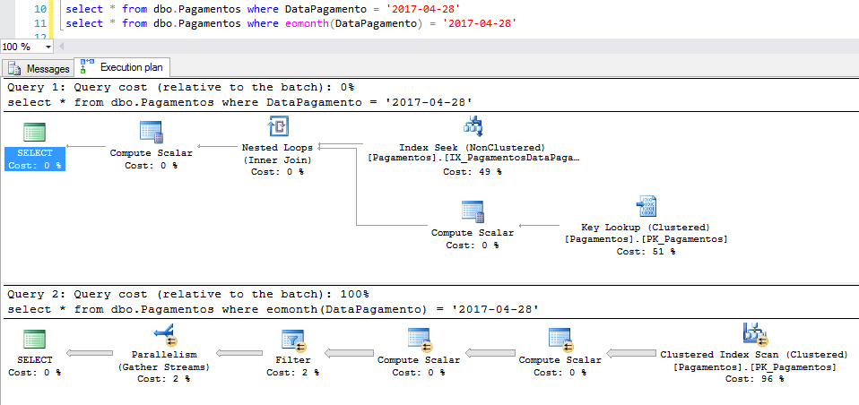
		

		
		

			
			<!-- Muito obrigado!   :) -->
		

		
		

		

	

	
	

		
Use a barra de espa谳 e as setas para navegar

	

	
	
	
	
	

</body>
</html>
